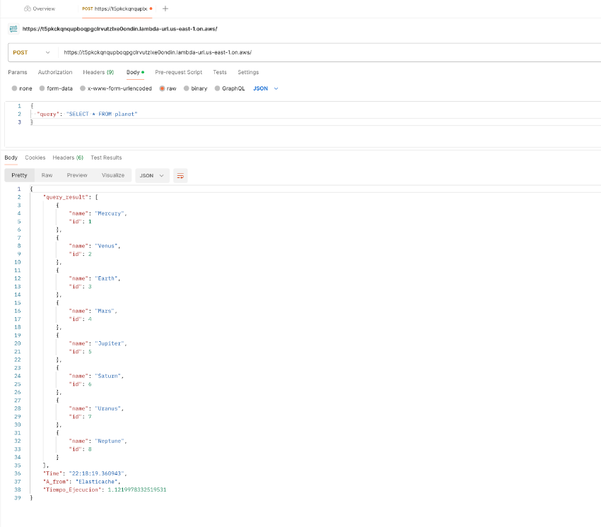
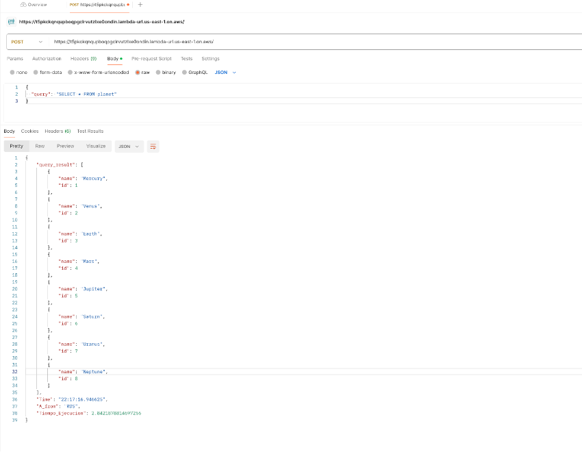

# aws-cache

## Laboratorio

1. Instalar la infraestructura necesaria [README.md](https://github.com/amolanol5/aws-cache/blob/master/infra/README.md)
2. Utilizar la URL que se obtiene en los outputs de terraform para invocar la lambda.
3. Utilizar un cliente como POSTMAN, en le body utilizar el siguiente json para realizar un Query a la base de datos.

```
{"query" : "SELECT * FROM planets"}

```
- Cuando se realice el  primer Get de la información requerida, se realiza un llamado a RDS y allí se consultan los datos, adicional se realiza un SET de los datos en  REDIS y se establece la cache de 30 segundos.




- En el segundo GET se puede observar como quien devuelve los datos es la base de datos de REDIS. de una manera mas rapida.



- Cuando finalice el tiempo del TTL , neuvamente se consultaran los datos en RDS