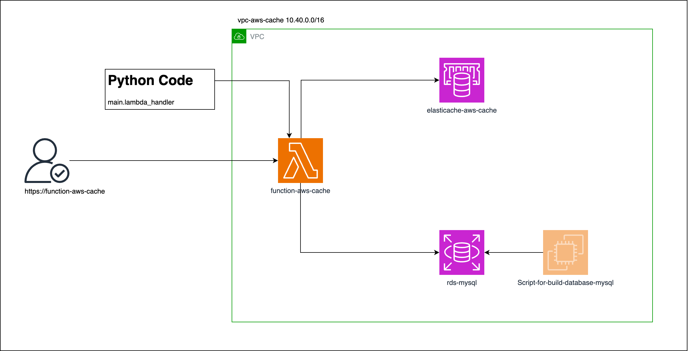

# infra aws-cache
Esquema de infraestructura



Para despleglar la infraesctructura (Puede tardar unos 7 minutos  )

1. Agregar el sigiuente archivo `terraform.tfvars` con las configuraciones necesarias ( puedes usar estos valores de ejemplo )

```terraform
project_name = "aws-cache"

config_elasticache = {
  cluster_size  = 1
  instance_type = "cache.t3.micro"
}

credential_elasticache = {
  user_name     = "testuser"
  access_string = "on ~* +@all"
  engine        = "REDIS"
  passwords     = ["Password123456-#$*"]
}

credential_rds_db = {
  username = "testuserdb"
  password = "abcde12345"
  name = "tutorial"
}
```

2. Ejecutar los siguientes comandos de terraform
```terraform
terraform init
terraform plan
terraform apply
```

3. En los outputs podras encontrar la URL para invocar la lambda.

    `terraform output`